<h1 align="center">SBTI 人格测试 · Pro 版完整图鉴</h1>

<p align="center">
  <em>MBTI 已经过时，SBTI 来了。</em><br>
  比 MBTI 更懂你的电子灵魂——<strong>17 维度 · 38 种人格 · 41 道题</strong>
</p>

<p align="center">
  <a href="https://sbti.ytht.io">
    
  </a>
</p>

<p align="center">
  
  
  
  
  
</p>

<p align="center">
  
  
  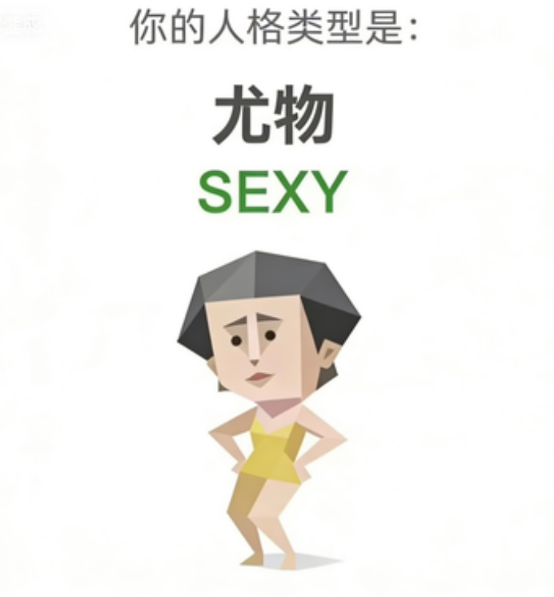
  
  
  
</p>

---

## 📖 目录

- [这是什么](#-这是什么)
- [在线体验](#-在线体验)
- [如何看懂你的结果](#-如何看懂你的结果)
- [十七维度一览](#-十七维度一览)
- [稀有度排行榜](#-稀有度排行榜)
  - [🏆 最稀有 TOP 5](#-最稀有-top-5)
  - [📈 最常见 TOP 5](#-最常见-top-5)
  - [📜 完整 38 种排行榜](#-完整-38-种排行榜完整展开)
- [38 种人格图鉴](#-38-种人格图鉴)
  - [标准人格（25 种原版）](#标准人格25-种原版)
  - [v3 新增人格（13 种）](#v3-新增人格13-种)
  - [特殊人格（2 种）](#特殊人格2-种)
- [Pro 版新增内容](#-pro-版新增内容)
- [数据来源与原理](#-数据来源与原理)
- [本地运行](#-本地运行)
- [致谢](#-致谢)
- [版本历史](#-版本历史)
- [License](#-license)

---

## 🎯 这是什么

SBTI（Soul Bytes Type Indicator）是 [B站@蛆肉儿串儿](https://space.bilibili.com/417038183) 原创的电子时代人格测试。本仓库是在原版基础上扩展的 **Pro 版**：

| 项目 | 原版 | Pro v3.0 |
|------|------|----------|
| 维度 | 15 | **17**（新增 N1 焦虑基线 + N2 探索开放） |
| 人格 | 27（含2特殊） | **40**（38 标准 + 2 特殊） |
| 题目 | 30 + 1 隐藏 | **41**（含 2 道新维度题 + 7 道亚型鉴别题） |

每一个人格收录：
- 🏷️ **代号 + 中文名 + 开场台词**
- 💬 **一句话解读**（类比区分相似人格）
- 📊 **十七维度 H/M/L 标准模板**
- 🎨 **角色形象插画**（原版 25 种；v3 新增 13 种图片通过通义万相生成）
- 🎲 **理论稀有度**（原版 25 种数据来自 sbti-wiki 10 万次仿真；v3 新增待测算）

---

## 📱 在线体验

**👉 [sbti.ytht.io](https://sbti.ytht.io)**

- 📲 **一屏一题** — 移动端选中后 280ms 自动进入下一题
- 🔗 **URL 分享** — 结果写入 `location.hash`（如 `sbti.ytht.io/#CTRL`）
- 🖼️ **分享图片** — 750×1334 Canvas 卡片，含 QR 码

---

## 🧭 如何看懂你的结果

答题结束后系统做 3 件事：

| 步骤 | 做什么 |
|---|---|
| **1️⃣ 打分** | 把 41 道题的答案汇总到 **17 个维度**，每个维度按题目数归一化后打出 L（低）/ M（中）/ H（高）三档 |
| **2️⃣ 匹配** | 拿你的 17 维向量去和 38 个标准人格模板比对，**曼哈顿距离**最近的那个就是你的主类型。公式：`相似度 = (1 − 距离 / 34) × 100%` |
| **3️⃣ 特殊分支** | 两种情况会跳过正常匹配：<br>① 最高匹配度 **< 60%** → 强制兜底 `HHHH`（傻乐者）<br>② 饮酒题选"保温杯装白酒当白开水喝" → 隐藏结局 `DRUNK`（酒鬼） |

> 💡 **v3 说明**：原版每维度固定 2 题（分档 ≤3→L / 4→M / ≥5→H）。Pro 版部分维度扩展到 3 题，系统按题目数动态归一化，确保跨维度距离可比。分母从 30 扩展到 34 是因为 17 维 × 2 档距 = 34。

---

## 🧬 十七维度一览

测试把人拆成 **6 组模型 × 共 17 维度**：

<table>
<tr>
  <th>模型</th>
  <th colspan="3">维度</th>
</tr>
<tr>
  <td><strong>🪞 自我模型</strong></td>
  <td>S1 自尊自信</td>
  <td>S2 自我清晰度</td>
  <td>S3 核心价值</td>
</tr>
<tr>
  <td><strong>❤️ 情感模型</strong></td>
  <td>E1 依恋安全感</td>
  <td>E2 情感投入度</td>
  <td>E3 边界与依赖</td>
</tr>
<tr>
  <td><strong>🌍 态度模型</strong></td>
  <td>A1 世界观倾向</td>
  <td>A2 规则与灵活度</td>
  <td>A3 人生意义感</td>
</tr>
<tr>
  <td><strong>⚡ 行动驱力</strong></td>
  <td>Ac1 动机导向</td>
  <td>Ac2 决策风格</td>
  <td>Ac3 执行模式</td>
</tr>
<tr>
  <td><strong>💬 社交模型</strong></td>
  <td>So1 社交主动性</td>
  <td>So2 人际边界感</td>
  <td>So3 表达与真实度</td>
</tr>
<tr>
  <td><strong>🌀 神经质·开放性</strong><br><sub>（Pro v3 新增）</sub></td>
  <td>N1 焦虑基线</td>
  <td>N2 探索开放</td>
  <td></td>
</tr>
</table>

> 原版 15 维（S1–So3）每维由 **2 道题**打分；Pro v3 新增的 N1/N2 各由 **2 道题**打分（同步扩展相似度分母至 34）。

---

## 📊 稀有度排行榜

> **⚠️ 原版 25 种数据说明**：稀有度来自 [sbti-wiki](https://github.com/serenakeyitan/sbti-wiki) 对 3^15 ≈ 1434 万种均匀分布的 H/M/L 向量**随机采样 10 万次**、用原版匹配算法跑出的**理论分布**，非真实用户统计。DRUNK 按隐藏结局语义保守估计 0.8%。**v3 新增 13 种人格尚无仿真数据（标注"—"），待 17 维仿真完成后补充。**

> 💡 **冷知识**：BOSS（全 H 模板）在均匀随机分布里概率最低——凑齐全维度最高分极难；OJBK（偏 M 模板）反而是最容易命中的标准人格。HHHH 理论上只有 0.06% 的人触发，因为随机向量很少能和 38 个模板都保持 >40% 距离。

### 🏆 最稀有 TOP 5

| 排名 | 代号 | 中文名 | 理论占比 | 约每 N 人 1 个 |
|:---:|---|---|:---:|:---:|
| 🥇 1 | **HHHH** | 傻乐者 | **0.06%** | 1 / 1667 |
| 🥈 2 | **DRUNK** | 酒鬼 | **0.8%** | 1 / 125 |
| 🥉 3 | **BOSS** | 领导者 | **1.53%** | 1 / 65 |
| 4 | **POOR** | 贫困者 | **1.68%** | 1 / 60 |
| 5 | **WOC!** | 握草人 | **2.04%** | 1 / 49 |

### 📈 最常见 TOP 5

| 排名 | 代号 | 中文名 | 理论占比 | 约每 N 人 1 个 |
|:---:|---|---|:---:|:---:|
| 🔝 1 | **OJBK** | 无所谓人 | **9.92%** | 1 / 10 |
| 🔝 2 | **THAN-K** | 感恩者 | **7.76%** | 1 / 13 |
| 🔝 3 | **FAKE** | 伪人 | **6.61%** | 1 / 15 |
| 🔝 4 | **SEXY** | 尤物 | **5.94%** | 1 / 17 |
| 🔝 5 | **MALO** | 吗喽 | **5.71%** | 1 / 18 |

### 📜 完整 38 种排行榜（完整展开）

<details>
<summary>点击展开完整稀有度排行（25 种原版 + 13 种 v3 新增 + 2 种特殊）</summary>

**原版 25 种（sbti-wiki 10 万次仿真数据）**

| 排名 | 代号 | 中文名 | 理论占比 | 1/N | 分类 |
|:---:|---|---|:---:|:---:|:---:|
| 1 | OJBK | 无所谓人 | 9.92% | 1/10 | 极常见 |
| 2 | THAN-K | 感恩者 | 7.76% | 1/13 | 极常见 |
| 3 | FAKE | 伪人 | 6.61% | 1/15 | 较常见 |
| 4 | SEXY | 尤物 | 5.94% | 1/17 | 较常见 |
| 5 | MALO | 吗喽 | 5.71% | 1/18 | 较常见 |
| 6 | Dior-s | 屌丝 | 5.23% | 1/19 | 较常见 |
| 7 | MUM | 妈妈 | 5.14% | 1/19 | 较常见 |
| 8 | ZZZZ | 装死者 | 4.68% | 1/21 | 中等 |
| 9 | LOVE-R | 多情者 | 4.23% | 1/24 | 中等 |
| 10 | IMSB | 傻者 | 4.21% | 1/24 | 中等 |
| 11 | SOLO | 孤儿 | 3.72% | 1/27 | 中等 |
| 12 | CTRL | 拿捏者 | 3.61% | 1/28 | 中等 |
| 13 | FUCK | 草者 | 3.38% | 1/30 | 中等 |
| 14 | OH-NO | 哦不人 | 3.05% | 1/33 | 中等 |
| 15 | GOGO | 行者 | 3.05% | 1/33 | 中等 |
| 16 | JOKE-R | 小丑 | 2.99% | 1/33 | 中等 |
| 17 | MONK | 僧人 | 2.80% | 1/36 | 偏稀有 |
| 18 | SHIT | 愤世者 | 2.53% | 1/40 | 偏稀有 |
| 19 | DEAD | 死者 | 2.50% | 1/40 | 偏稀有 |
| 20 | ATM-er | 送钱者 | 2.46% | 1/41 | 偏稀有 |
| 21 | THIN-K | 思考者 | 2.24% | 1/45 | 偏稀有 |
| 22 | IMFW | 废物 | 2.12% | 1/47 | 偏稀有 |
| 23 | WOC! | 握草人 | 2.04% | 1/49 | 偏稀有 |
| 24 | POOR | 贫困者 | 1.68% | 1/60 | 稀有 |
| 25 | BOSS | 领导者 | 1.53% | 1/65 | 稀有 |

**v3 新增 13 种（尚无仿真数据）**

| 代号 | 中文名 | 理论占比 | 备注 |
|---|---|:---:|---|
| PULL | 暗控者 | —（待测算） | CTRL 亚型（隐性控制） |
| NOPE | 回避者 | —（待测算） | 高回避依恋 |
| LOOP | 死循环者 | —（待测算） | THIN-K 高焦虑亚型 |
| RUST | 内腐者 | —（待测算） | SHIT 内化亚型 |
| CLOS | 封闭者 | —（待测算） | SOLO 主动隔绝亚型 |
| CLIN | 黏附者 | —（待测算） | 焦虑型依恋 |
| MASK | 无感面具 | —（待测算） | FAKE 情感解离亚型 |
| WIRE | 高压线 | —（待测算） | GOGO 焦虑驱动亚型 |
| FAWN | 讨好者 | —（待测算） | 高取悦低自我 |
| ECHO | 回声室 | —（待测算） | 低分化高共鸣 |
| DRIFT | 漂流者 | —（待测算） | 全维度低分化 |
| KEEN | 探索狂 | —（待测算） | 高 N2 探索开放 |
| MIST | 焦虑虚空 | —（待测算） | 高 N1 焦虑基线 |

**2 种特殊人格（触发式）**

| 代号 | 中文名 | 估算占比 | 触发条件 |
|---|---|:---:|---|
| DRUNK | 酒鬼 | 0.80% | 饮酒题选"保温杯装白酒当白开水喝" |
| HHHH | 傻乐者 | 0.06% | 所有标准人格匹配度均 < 60%（全榜最稀有） |

</details>

---

## 🖼️ 38 种人格图鉴

### 标准人格（25 种原版）

<table>
  <tr>
    <td align="center" width="33%">
      <br>
      <strong>CTRL · 拿捏者</strong><br>
      <sub>人形自走任务管理器</sub><br>
      <sub>🎲 3.61% · 1/28</sub>
    </td>
    <td align="center" width="33%">
      <br>
      <strong>ATM-er · 送钱者</strong><br>
      <sub>永远在支付时间、精力、耐心</sub><br>
      <sub>🎲 2.46% · 1/41</sub>
    </td>
    <td align="center" width="33%">
      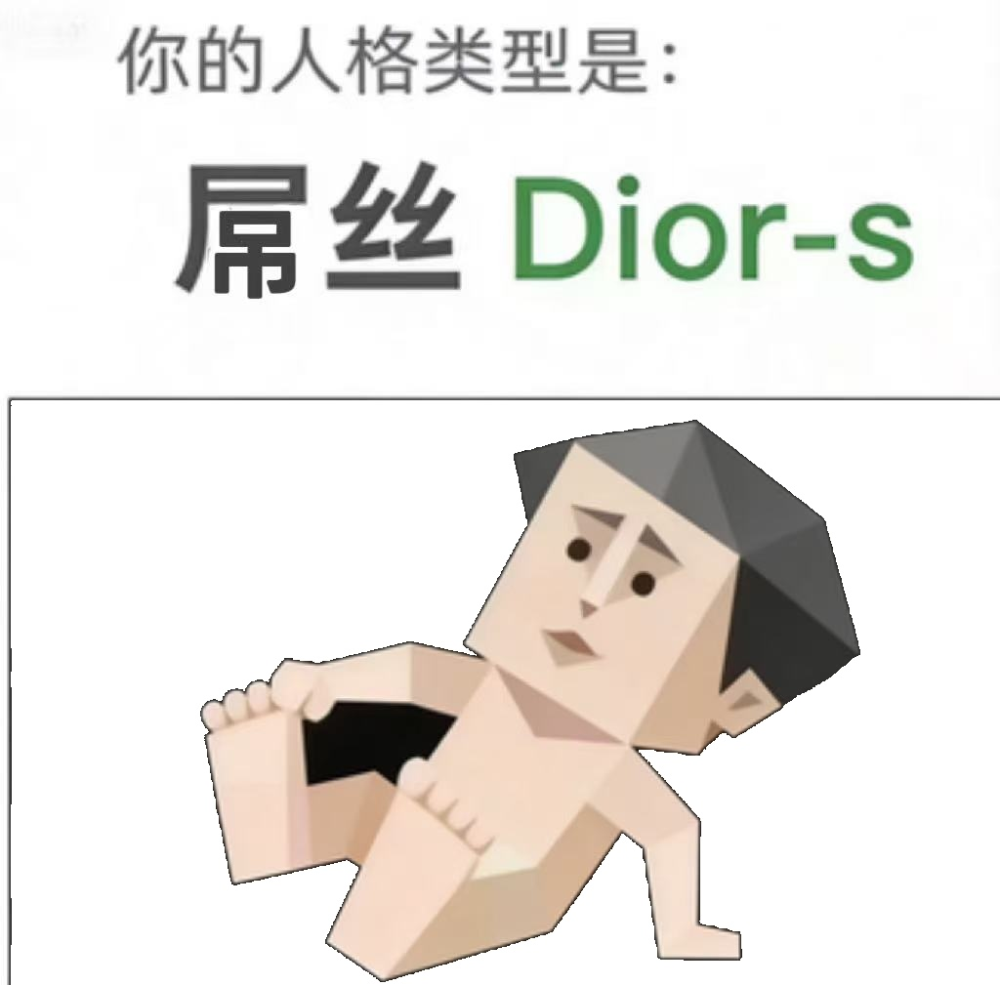<br>
      <strong>Dior-s · 屌丝</strong><br>
      <sub>第欧根尼的精神传人</sub><br>
      <sub>🎲 5.23% · 1/19</sub>
    </td>
  </tr>
  <tr>
    <td align="center">
      <br>
      <strong>BOSS · 领导者</strong><br>
      <sub>手里永远拿着方向盘的人</sub><br>
      <sub>🎲 1.53% · 1/65</sub>
    </td>
    <td align="center">
      <br>
      <strong>THAN-K · 感恩者</strong><br>
      <sub>永不枯竭的正能量发射塔</sub><br>
      <sub>🎲 7.76% · 1/13</sub>
    </td>
    <td align="center">
      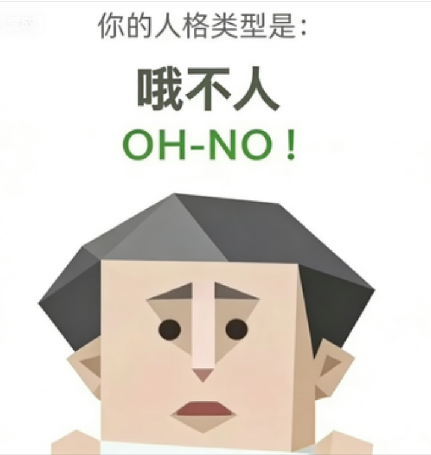<br>
      <strong>OH-NO · 哦不人</strong><br>
      <sub>一声"Oh no!"把风险扼杀在萌芽</sub><br>
      <sub>🎲 3.05% · 1/33</sub>
    </td>
  </tr>
  <tr>
    <td align="center">
      <br>
      <strong>GOGO · 行者</strong><br>
      <sub>世界只有已完成和即将被完成</sub><br>
      <sub>🎲 3.05% · 1/33</sub>
    </td>
    <td align="center">
      <br>
      <strong>SEXY · 尤物</strong><br>
      <sub>走进房间照明系统自动识别</sub><br>
      <sub>🎲 5.94% · 1/17</sub>
    </td>
    <td align="center">
      <br>
      <strong>LOVE-R · 多情者</strong><br>
      <sub>情感处理器是彩虹制的吟游诗人</sub><br>
      <sub>🎲 4.23% · 1/24</sub>
    </td>
  </tr>
  <tr>
    <td align="center">
      <br>
      <strong>MUM · 妈妈</strong><br>
      <sub>给自己的药剂量总是小一号</sub><br>
      <sub>🎲 5.14% · 1/19</sub>
    </td>
    <td align="center">
      <br>
      <strong>FAKE · 伪人</strong><br>
      <sub>切面具比切输入法还快</sub><br>
      <sub>🎲 6.61% · 1/15</sub>
    </td>
    <td align="center">
      <br>
      <strong>OJBK · 无所谓人</strong><br>
      <sub>"都行"是一种统治哲学</sub><br>
      <sub>🎲 9.92% · 1/10</sub>
    </td>
  </tr>
  <tr>
    <td align="center">
      <br>
      <strong>MALO · 吗喽</strong><br>
      <sub>灵魂还挂在树上荡秋千</sub><br>
      <sub>🎲 5.71% · 1/18</sub>
    </td>
    <td align="center">
      <br>
      <strong>JOKE-R · 小丑</strong><br>
      <sub>一层层打开最里面只剩回声</sub><br>
      <sub>🎲 2.99% · 1/33</sub>
    </td>
    <td align="center">
      <br>
      <strong>WOC! · 握草人</strong><br>
      <sub>表面"卧槽"后台冷静分析</sub><br>
      <sub>🎲 2.04% · 1/49</sub>
    </td>
  </tr>
  <tr>
    <td align="center">
      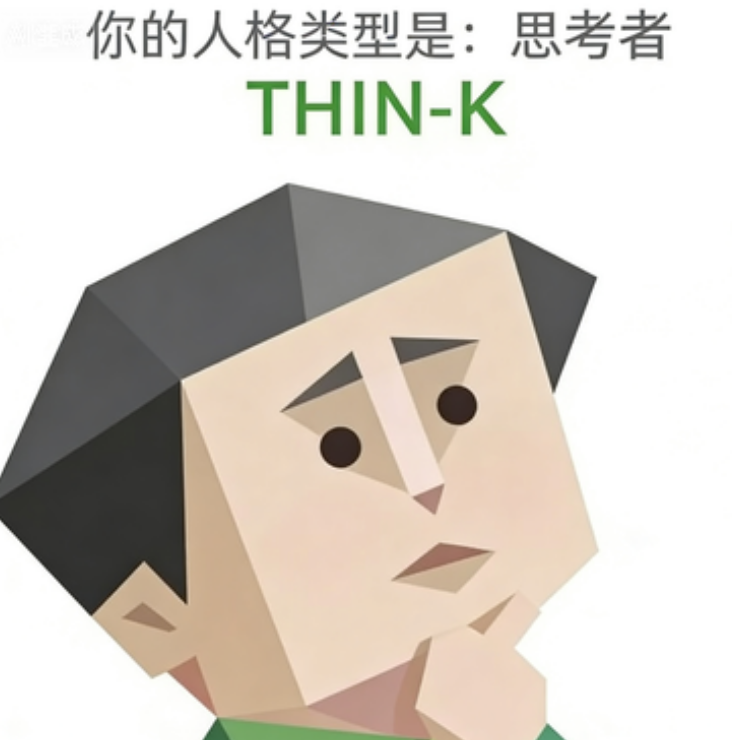<br>
      <strong>THIN-K · 思考者</strong><br>
      <sub>审判一切信息的偏执党</sub><br>
      <sub>🎲 2.24% · 1/45</sub>
    </td>
    <td align="center">
      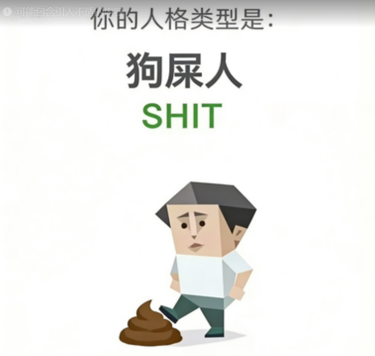<br>
      <strong>SHIT · 愤世者</strong><br>
      <sub>嘴上骂世界手上拯救世界</sub><br>
      <sub>🎲 2.53% · 1/40</sub>
    </td>
    <td align="center">
      <br>
      <strong>ZZZZ · 装死者</strong><br>
      <sub>死线一到 29 分钟交答卷</sub><br>
      <sub>🎲 4.68% · 1/21</sub>
    </td>
  </tr>
  <tr>
    <td align="center">
      <br>
      <strong>POOR · 贫困者</strong><br>
      <sub>精力全灌一个坑的矿井</sub><br>
      <sub>🎲 1.68% · 1/60</sub>
    </td>
    <td align="center">
      <br>
      <strong>MONK · 僧人</strong><br>
      <sub>结界神圣不可侵犯的修行者</sub><br>
      <sub>🎲 2.80% · 1/36</sub>
    </td>
    <td align="center">
      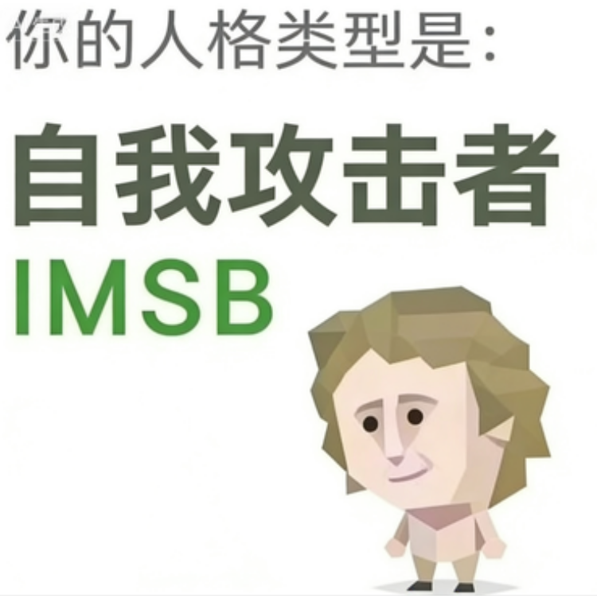<br>
      <strong>IMSB · 傻者</strong><br>
      <sub>内心戏比漫威宇宙还长</sub><br>
      <sub>🎲 4.21% · 1/24</sub>
    </td>
  </tr>
  <tr>
    <td align="center">
      <br>
      <strong>SOLO · 孤儿</strong><br>
      <sub>全身都是刺的软心脏刺猬</sub><br>
      <sub>🎲 3.72% · 1/27</sub>
    </td>
    <td align="center">
      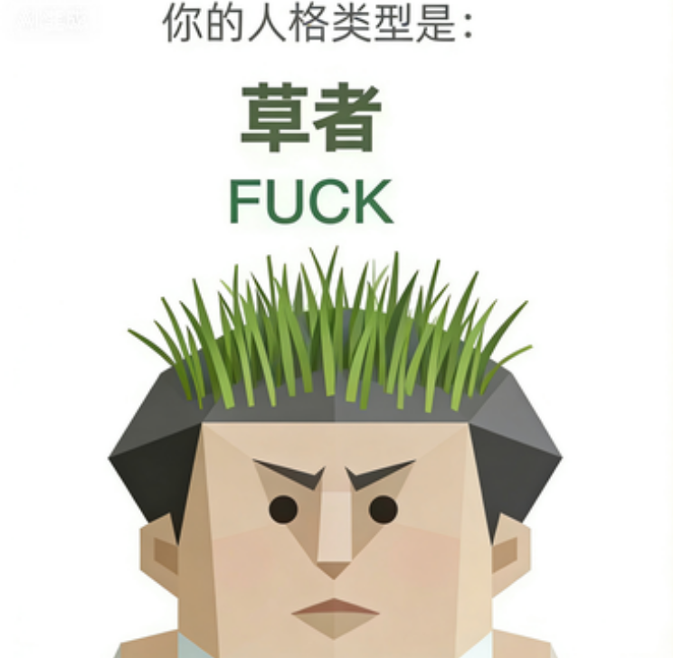<br>
      <strong>FUCK · 草者</strong><br>
      <sub>除草剂杀不死的人形野草</sub><br>
      <sub>🎲 3.38% · 1/30</sub>
    </td>
    <td align="center">
      <br>
      <strong>DEAD · 死者</strong><br>
      <sub>通关后删档 999 次的贤者</sub><br>
      <sub>🎲 2.50% · 1/40</sub>
    </td>
  </tr>
  <tr>
    <td align="center">
      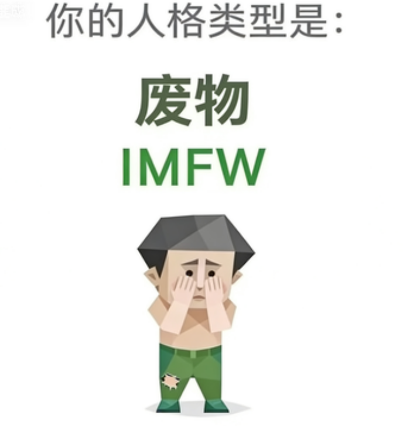<br>
      <strong>IMFW · 废物</strong><br>
      <sub>需要温室养护的兰花</sub><br>
      <sub>🎲 2.12% · 1/47</sub>
    </td>
    <td align="center" colspan="2">
      <em>⬇️ v3 新增人格见下方</em>
    </td>
  </tr>
</table>

### v3 新增人格（13 种）

> 这 13 种人格是 Pro v3.0 在原版基础上新增的亚型与填补类型，基于 17 维度（含 N1/N2）设计。图片通过通义万相 wanx2.1-t2i-turbo 生成（`scripts/gen_images.mjs`）。稀有度仿真待完成 17 维均匀分布采样后补充。

<table>
  <tr>
    <td align="center" width="33%">
      <br>
      <strong>PULL · 暗控者</strong><br>
      <sub>CTRL 的影子版本，幕后三分之二</sub><br>
      <sub>🎲 — （待测算）</sub>
    </td>
    <td align="center" width="33%">
      <br>
      <strong>NOPE · 回避者</strong><br>
      <sub>从小就学会了先跑的动物</sub><br>
      <sub>🎲 — （待测算）</sub>
    </td>
    <td align="center" width="33%">
      <br>
      <strong>LOOP · 死循环者</strong><br>
      <sub>已深度思考 9999 秒，尚未启动</sub><br>
      <sub>🎲 — （待测算）</sub>
    </td>
  </tr>
  <tr>
    <td align="center">
      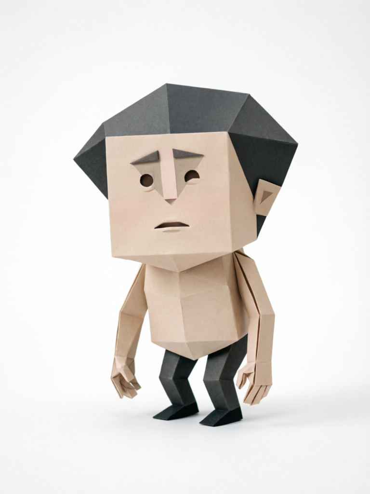<br>
      <strong>RUST · 内腐者</strong><br>
      <sub>SHIT 往外喷，RUST 往里溃</sub><br>
      <sub>🎲 — （待测算）</sub>
    </td>
    <td align="center">
      <br>
      <strong>CLOS · 封闭者</strong><br>
      <sub>SOLO 的门虚掩，CLOS 的门焊死了</sub><br>
      <sub>🎲 — （待测算）</sub>
    </td>
    <td align="center">
      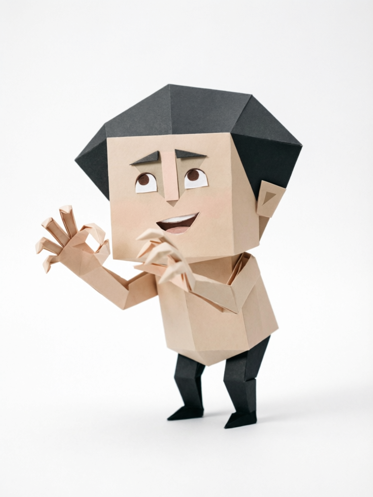<br>
      <strong>CLIN · 黏附者</strong><br>
      <sub>LOVE-R 是主语，CLIN 的主语是对方</sub><br>
      <sub>🎲 — （待测算）</sub>
    </td>
  </tr>
  <tr>
    <td align="center">
      <br>
      <strong>MASK · 无感面具</strong><br>
      <sub>脱完了，底下空的</sub><br>
      <sub>🎲 — （待测算）</sub>
    </td>
    <td align="center">
      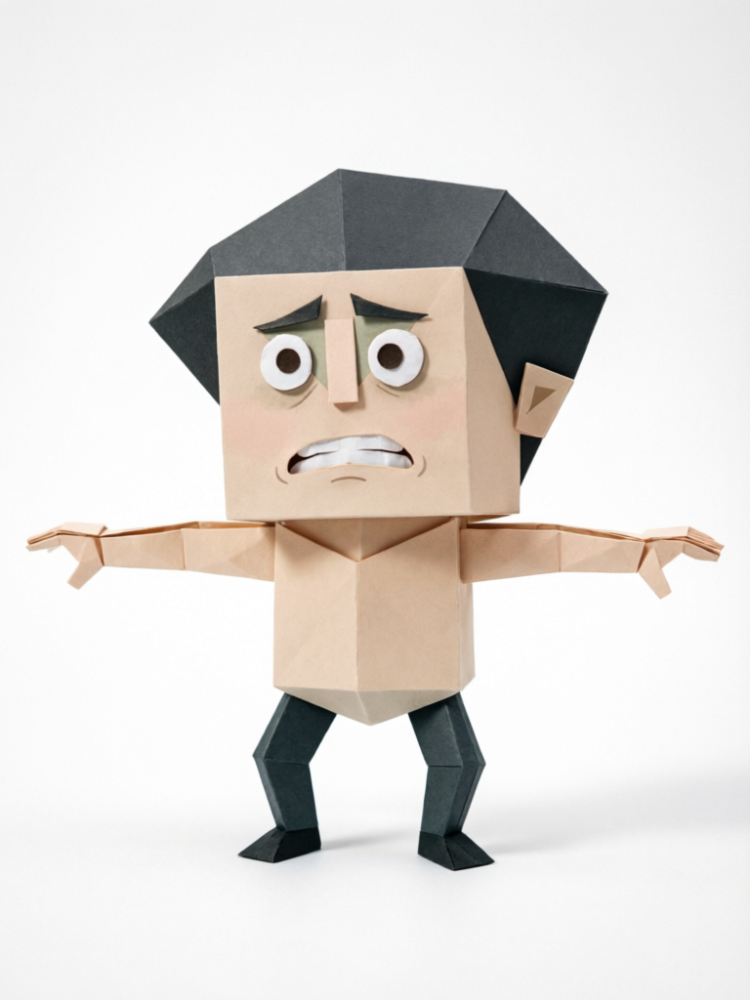<br>
      <strong>WIRE · 高压线</strong><br>
      <sub>GOGO 追光，WIRE 逃暗</sub><br>
      <sub>🎲 — （待测算）</sub>
    </td>
    <td align="center">
      <br>
      <strong>FAWN · 讨好者</strong><br>
      <sub>天生的矛盾熄灭器，代价是自己也灭了</sub><br>
      <sub>🎲 — （待测算）</sub>
    </td>
  </tr>
  <tr>
    <td align="center">
      <br>
      <strong>ECHO · 回声室</strong><br>
      <sub>让每个人都感觉被理解，除了自己</sub><br>
      <sub>🎲 — （待测算）</sub>
    </td>
    <td align="center">
      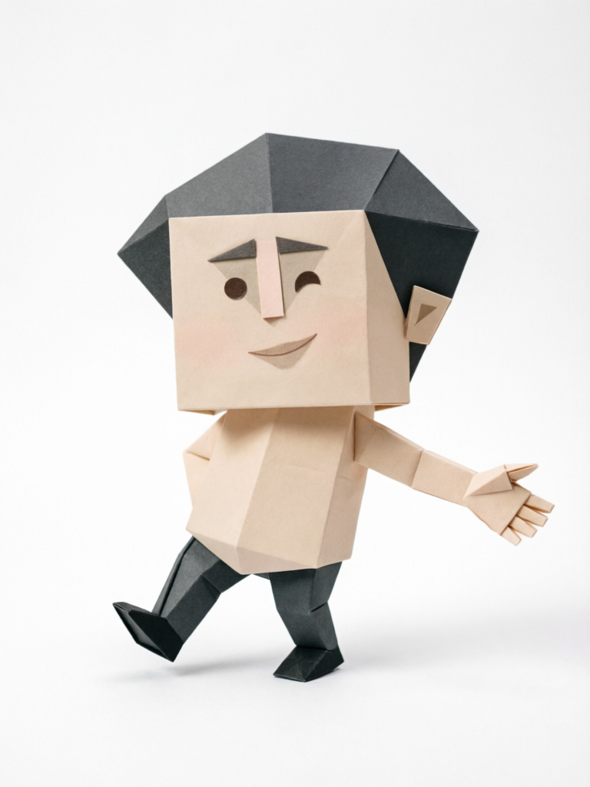<br>
      <strong>DRIFT · 漂流者</strong><br>
      <sub>方向？好像不是我的标配</sub><br>
      <sub>🎲 — （待测算）</sub>
    </td>
    <td align="center">
      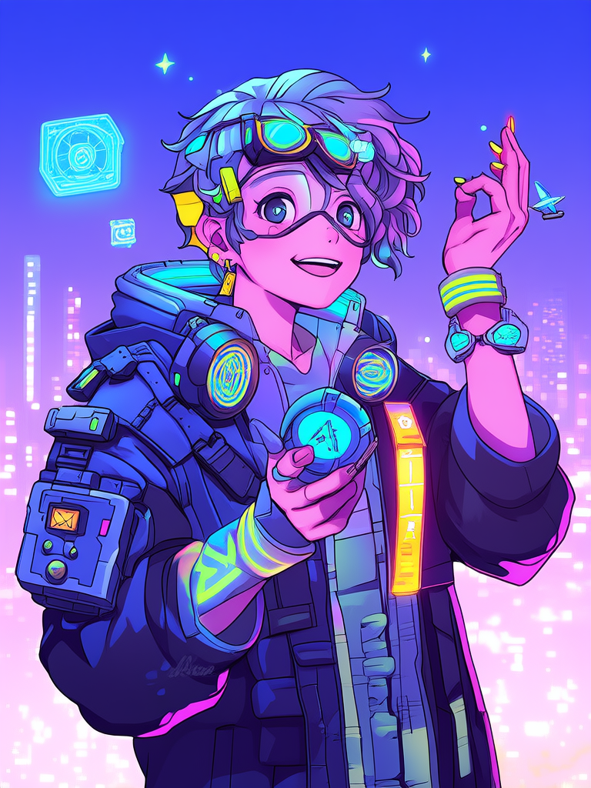<br>
      <strong>KEEN · 探索狂</strong><br>
      <sub>好奇心是发动机，人生遗憾是只有一条命</sub><br>
      <sub>🎲 — （待测算）</sub>
    </td>
  </tr>
  <tr>
    <td align="center">
      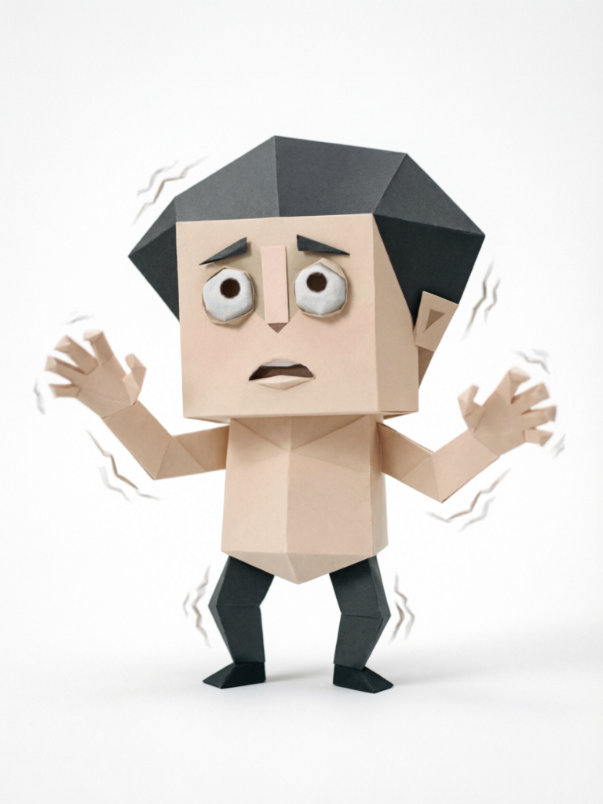<br>
      <strong>MIST · 焦虑虚空</strong><br>
      <sub>海面下一直有东西在动，但你不知道是什么</sub><br>
      <sub>🎲 — （待测算）</sub>
    </td>
    <td align="center" colspan="2">
      <em>⬇️ 特殊人格见下方</em>
    </td>
  </tr>
</table>

### 特殊人格（2 种）

<table>
  <tr>
    <td align="center" width="50%">
      <br>
      <strong>HHHH · 傻乐者</strong><br>
      <sub>🎲 <em>触发条件</em>：最高匹配度 &lt; 60% 的系统强制兜底</sub><br>
      <sub>📊 理论占比 <strong>0.06%</strong> · 约 1/1667（全榜最稀有）</sub>
    </td>
    <td align="center" width="50%">
      <br>
      <strong>DRUNK · 酒鬼</strong><br>
      <sub>🍶 <em>触发条件</em>：饮酒题选"保温杯装白酒当白开水喝"</sub><br>
      <sub>📊 估算占比 <strong>0.8%</strong> · 约 1/125（隐藏结局）</sub>
    </td>
  </tr>
</table>

---

## ✨ Pro 版新增内容

### v3.0 新增

- **17 个维度** — 新增 N1 焦虑基线 + N2 探索开放，填补 Big Five 对应空白
- **38 种标准人格** — 8 个亚型分裂（CTRL→PULL、GOGO→WIRE、THIN-K→LOOP、SHIT→RUST、SOLO→CLOS、LOVE-R→CLIN、FAKE→MASK）+ 5 个全新填补类型（FAWN、ECHO、DRIFT、KEEN、MIST）
- **41 道题目** — 含 2 道新维度题（N1/N2）+ 7 道亚型鉴别题
- **sbti-wiki 数据** — 稀有度、一句话简介数据来自 [serenakeyitan/sbti-wiki](https://github.com/serenakeyitan/sbti-wiki)
- **图片生成** — 新类型形象通过通义万相 wanx2.1-t2i-turbo 生成（`scripts/gen_images.mjs`）

### 分享功能

- **URL 分享** — 结果写入 `location.hash`（如 `#CTRL`），直接打开可查看他人结果
- **生成分享图片** — 750×1334 Canvas 卡片，含 QR 码（扫码直达 `sbti.ytht.io/#TYPECODE`）
- **OG/Twitter Meta** — 分享链接时展示卡片预览

### 移动端

- **一屏一题** — 选中后 280ms 自动进入下一题
- **触控优化** — `touch-action: manipulation` 消除 300ms 延迟

---

## 🔬 数据来源与原理

### 原版数据（原作者所有）

原版测试逻辑包含 4 个 JavaScript 常量：

| 常量名 | 内容 |
|---|---|
| `TYPE_LIBRARY` | 人格的 `code` / `cn` / `intro` / `desc`（完整文案） |
| `NORMAL_TYPES` | 标准人格的 H/M/L 模板字符串 |
| `DIM_EXPLANATIONS` | 维度 × 三档 = 分档解读 |
| `dimensionMeta` | 每个维度的中文名和所属模型分组 |

### sbti-wiki 数据（CC BY-NC-SA 4.0）

原版 25 种人格的：
- 理论稀有度（3^15 均匀分布 10 万次仿真，[sbti-cli](https://github.com/bingran-you/sbti-cli) 算法）
- 一句话简介（整理者注解）

### Pro v3 新增数据

- N1/N2 维度定义与分档解读（Pro 版新增）
- 13 种新增人格的模板、描述、开场台词（Pro 版新增）
- 图片：13 种新增人格形象通过通义万相 API 生成

### 生成新人格图片

```bash
DASHSCOPE_API_KEY=xxx node scripts/gen_images.mjs
# 生成 image/PULL.png … image/MIST.png（共 13 张）
```

---

## 🚀 本地运行

```bash
git clone https://github.com/yupoet/SBTI-PRO.git
cd SBTI-PRO
open index.html
```

---

## 🙏 致谢

<table>
  <tr>
    <th>项目 / 作者</th>
    <th>贡献</th>
  </tr>
  <tr>
    <td><a href="https://space.bilibili.com/417038183"><strong>B站@蛆肉儿串儿</strong></a></td>
    <td>SBTI 原作者。30 道题目、27 种人格描述文案与形象插画的版权持有者。测试首发是为了劝一位爱喝酒的朋友戒酒。</td>
  </tr>
  <tr>
    <td><a href="https://github.com/serenakeyitan/sbti-wiki"><strong>sbti-wiki</strong></a>（@serenakeyitan）</td>
    <td>提供原版 25 种人格的理论稀有度数据（3^15 仿真）和一句话简介，遵循 CC BY-NC-SA 4.0。</td>
  </tr>
  <tr>
    <td><a href="https://github.com/bingran-you/sbti-cli"><strong>sbti-cli</strong></a>（@bingran-you）</td>
    <td>Node.js sandbox runtime，从官网 main.js 直接导出 TYPE_LIBRARY 等内部常量，使 sbti-wiki 数据达到字节级对齐。</td>
  </tr>
  <tr>
    <td><strong>YTHT Reborn</strong></td>
    <td>Pro 版新增：N1/N2 维度、13 种新人格、41 道题、分享图片、移动端优化。</td>
  </tr>
  <tr>
    <td><strong>友情链接</strong></td>
    <td><a href="https://bbs.ytht.io">一塌糊涂 BBS</a> · <a href="https://game.ytht.io">修仙 MUD</a></td>
  </tr>
</table>

> ⚠️ **仅供娱乐**：原作者已在测试首页写清楚——"别拿它当诊断、面试、相亲、分手、招魂、算命或人生判决书"。

---

## 📋 版本历史

### v3.0.0（2026-04-10）
- 维度扩展至 17 个（N1 焦虑基线 / N2 探索开放）
- 人格扩展至 38 种（8 亚型分裂 + 5 新增填补类型）
- 题目扩展至 41 道
- 整合 sbti-wiki 稀有度和一句话简介

### v2.1.0（2026-04-10）
- 分享图片加入人格描述正文
- 修复 SBTI 标题换行 + I/来 字符碰撞
- 友情链接改为竖排，CSS 对齐 NCB 色彩系统

### v2.0.0（2026-04-10）
- Apple 风格全屏 Hero、手风琴人格展示、Bebas Neue 艺术字
- 分享图片 + QR 码功能
- Cloudflare Pages 自动部署

### v1.0.0（2026-04-10）
- 原版测试内容完整保留

---

## 📄 License

本项目内容（题目、人格描述文案、形象插画）版权归原作者 B站@蛆肉儿串儿 所有，**不得商业使用**。  
稀有度数据和一句话简介来自 [sbti-wiki](https://github.com/serenakeyitan/sbti-wiki)，遵循 **CC BY-NC-SA 4.0**。  
代码部分（Pro 版新增功能）以 **MIT** 协议开源。
